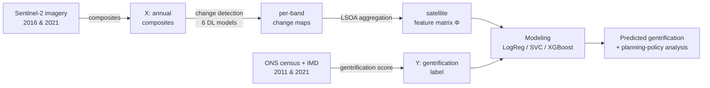

# Gentrification from the Sky 🛰️

**Measuring urban gentrification in Greater London from open satellite imagery using deep-learning change detection and machine learning.**

[](https://www.python.org/)
[](LICENSE)
[](https://github.com/astral-sh/uv)

This repository accompanies the paper *"Gentrification from the Sky: Using Remote
Sensing and Machine Learning for Urban Change Detection"* (CUPUM 2025), by
Javier Alfaro, Sanja Šćepanović, Stephen Law, and Daniele Quercia.

Traditional gentrification measurement leans on census data — costly, slow, and
spatially coarse. This project detects the **physical** signatures of
gentrification (building density, rooftop materials, green space) directly from
**open Sentinel-2 imagery**, and shows they improve gentrification prediction
across **4,085 London neighborhoods (LSOAs)** by up to **8%**, reaching a
**balanced accuracy of ~77%**.

## How it works



| Stage | Package | Paper |
|---|---|---|
| **X** — build Sentinel-2 composites | [`gfs.composites`](src/gfs/composites) | §3.2 |
| **Models** — deep-learning change detection | [`gfs.change_detection`](src/gfs/change_detection) | §3.3 |
| **Y** — census gentrification score | [`gfs.gentrification`](src/gfs/gentrification) | §3.1 |
| Aggregation + prediction | [`gfs.modeling`](src/gfs/modeling) | §3.5, §4–5 |
| Maps & figures | [`gfs.viz`](src/gfs/viz) | figures |

### Change-detection models compared (§3.3)
`Simple-Diff` · `Res-Net` · `FC-SiamDiff` · `CGNet` · `Bi-Temporal Siamese (BiDateNet)` · `TinyCD`

### Headline results (§5)
| Model | Balanced accuracy | F1 | ROC-AUC |
|---|---|---|---|
| Logistic Regression | 0.743 ± 0.051 | 0.742 ± 0.050 | 0.806 ± 0.047 |
| Linear SVC | 0.743 ± 0.050 | 0.740 ± 0.048 | 0.810 ± 0.046 |
| **XGBoost** | **0.767 ± 0.049** | **0.766 ± 0.049** | **0.841 ± 0.043** |

## Repository layout

```
src/gfs/
├── config.py            # paths, years, bands, hyperparameters
├── composites/          # X: Sentinel-2 composites via Earth Engine
├── change_detection/    # the 6 DL change-detection models
│   ├── common.py        #   patching, Otsu thresholding, losses, training
│   └── models/          #   one module per architecture
├── gentrification/      # Y: census-based gentrification score
├── modeling/            # LSOA aggregation, classifiers, ablation
└── viz/                 # maps & figures
scripts/                 # runnable pipeline entrypoints + data/Dropbox helpers
notebooks/               # thin narrative notebooks (output-stripped)
data/                    # datasets (git-ignored; see data/README.md)
```

## Installation

This project is managed with [**uv**](https://github.com/astral-sh/uv).

```bash
git clone https://github.com/jaroxciv/Gentrification-from-the-Sky.git
cd Gentrification-from-the-Sky
uv sync                       # creates .venv and installs everything (CPU torch)
```

> Earth Engine steps require a one-time `earthengine authenticate`.

## Reproducing the pipeline

The project ships a single CLI, **`gfs`** (run `uv run gfs --help` to see it):

```bash
uv run scripts/fetch_data.py   # 0. get the datasets (see data/README.md)
uv run gfs composites          # 1. X: Sentinel-2 composites (free STAC source by default)
uv run gfs landcover           #    Dynamic World land cover (green areas) via Earth Engine
uv run gfs change-detect       # 2. models: detect change -> per-band features
uv run gfs gentrification      # 3. Y: census gentrification score
uv run gfs model --model tinycd  # 4. predict gentrification
uv run gfs ablation            # 5. thresholding ablation
uv run gfs export --model tinycd # bundle a shareable LSOA GeoPackage
```

The numbered `scripts/NN_*.py` remain as thin wrappers around the same commands.

**Data sources.** The composites are rebuilt from open Sentinel-2 COGs via a STAC
API by default (`gfs composites`, free, no account). The original work used the
WASDI platform — reproduce that route with `gfs composites --source wasdi --confirm`
(licensed; arrange usage rights with the WASDI team). Both produce the same
summer cloud-masked median; the built composites also ship as data, so neither
upstream service is required to run the pipeline.

## Development

```bash
uv sync --dev
uv run pytest            # behavioral tests (functional contracts)
uv run ruff check .      # lint
uv run ruff format .     # format
uv run basedpyright src/ scripts/ tests/   # type-check
uv run pre-commit install  # enable hooks on commit
```

## Citation

If you use this work, please cite the paper (see [`CITATION.cff`](CITATION.cff)):

```bibtex
@inproceedings{alfaro2025gentrification,
  title     = {Gentrification from the Sky: Using Remote Sensing and Machine Learning for Urban Change Detection},
  author    = {Alfaro, Javier and {\v{S}}{\'c}epanovi{\'c}, Sanja and Law, Stephen and Quercia, Daniele},
  booktitle = {Computational Urban Planning and Urban Management (CUPUM)},
  year      = {2025}
}
```

## License

[MIT](LICENSE) — data sources retain their respective licenses (ESA Copernicus, ONS, GOV.UK IMD).
